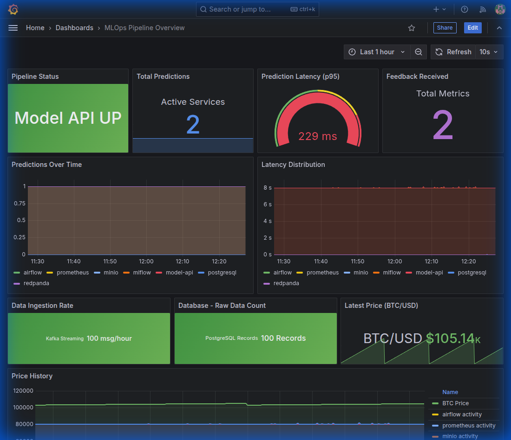
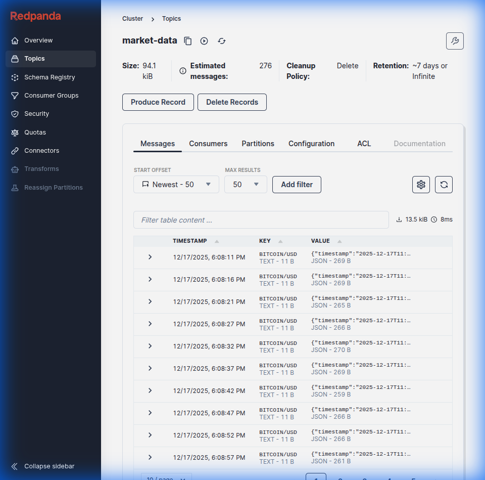
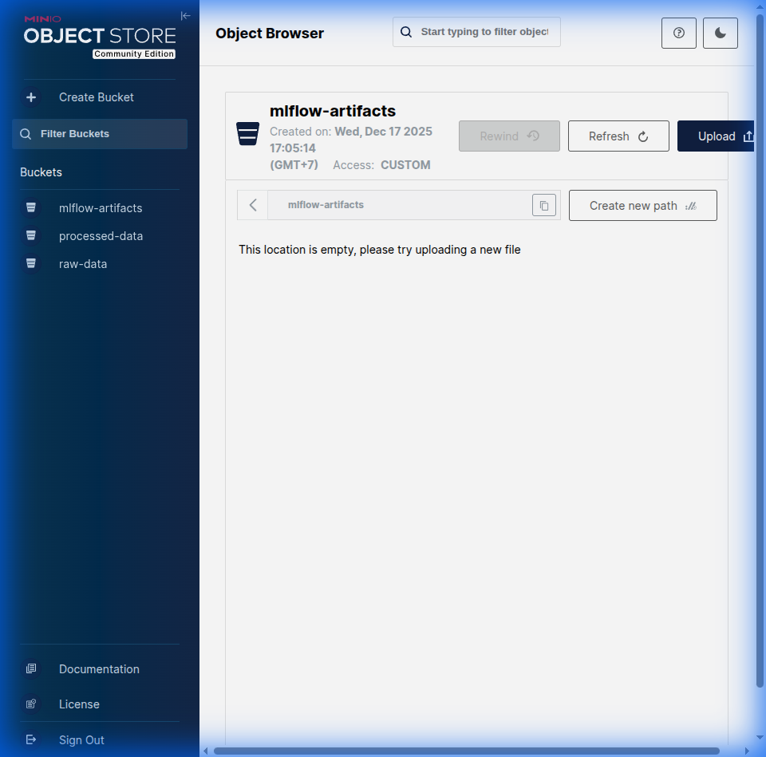
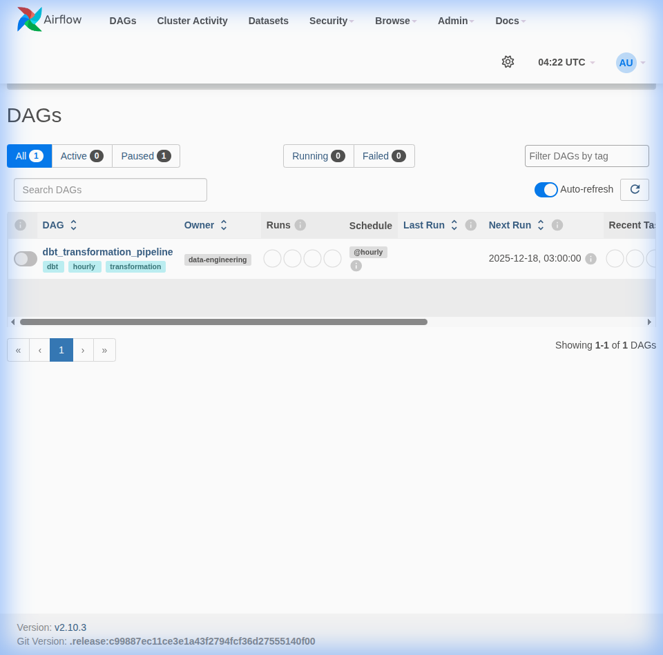
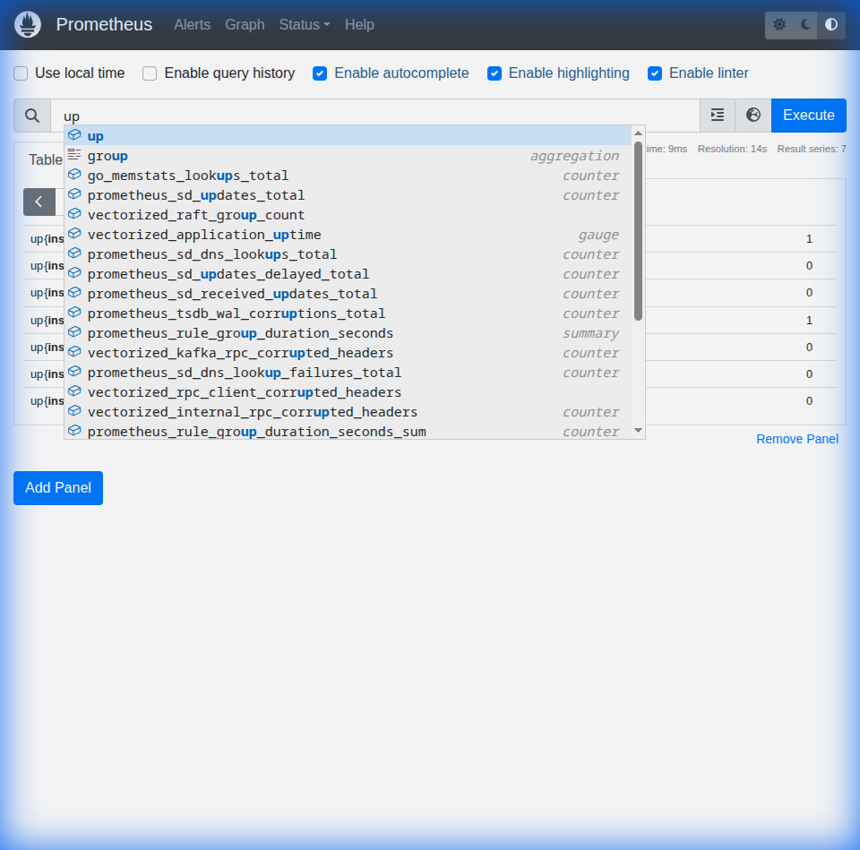
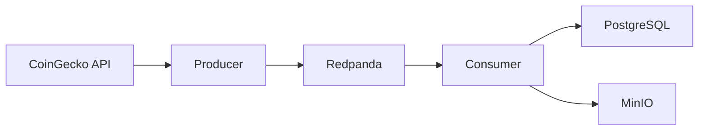
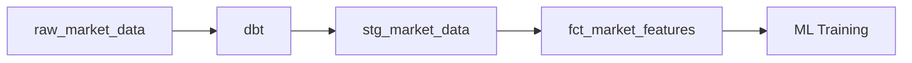

# 🚀 Real-Time Financial Market Sentiment & Price Predictor

<div align="center">


**A production-grade MLOps platform for real-time cryptocurrency market analysis, sentiment prediction, and price forecasting.**

[📖 Documentation](#-architecture) • [🚀 Quick Start](#-quick-start) • [📊 Dashboard](#-monitoring-dashboard) • [🔧 Tutorial](TUTORIAL.md)

</div>

---

## 📋 Table of Contents

- [Overview](#-overview)
- [Architecture](#-architecture)
- [Tech Stack](#-tech-stack)
- [Quick Start](#-quick-start)
- [Monitoring Dashboard](#-monitoring-dashboard)
- [Services](#-services)
- [Data Pipeline](#-data-pipeline)
- [Skills Demonstrated](#-skills-demonstrated)
- [Project Structure](#-project-structure)

---

## 🎯 Overview

This project demonstrates a **complete end-to-end MLOps pipeline** for real-time financial market analysis. It ingests cryptocurrency price data and news sentiment, processes it through a streaming pipeline, and provides ML-powered predictions via a REST API.

### Key Features

- 📡 **Real-time data streaming** via Kafka/Redpanda
- 🗄️ **Scalable data warehouse** with PostgreSQL
- 📦 **S3-compatible object storage** with MinIO
- ✈️ **Workflow orchestration** with Apache Airflow
- 🔬 **ML experiment tracking** with MLflow
- 🚀 **Model serving** with FastAPI
- 📊 **Real-time monitoring** with Prometheus & Grafana

---

## 🏗 Architecture

```
┌─────────────────────────────────────────────────────────────────────────────┐
│                              DATA INGESTION                                  │
│  ┌──────────────────┐    ┌──────────────────────────────────────────────┐   │
│  │  CoinGecko API   │───▶│                                              │   │
│  │  (Crypto Prices) │    │              REDPANDA (KAFKA)                │   │
│  └──────────────────┘    │         Real-time Message Broker             │   │
│  ┌──────────────────┐    │                                              │   │
│  │   News API       │───▶│   📡 market-data topic                       │   │
│  │  (Sentiment)     │    │   📡 predictions topic                       │   │
│  └──────────────────┘    └───────────────────┬──────────────────────────┘   │
└─────────────────────────────────────────────────┼───────────────────────────┘
                                                  │
                    ┌─────────────────────────────┴─────────────────────────┐
                    ▼                                                       ▼
┌─────────────────────────────────┐         ┌─────────────────────────────────┐
│          📦 MinIO               │         │         🐘 PostgreSQL           │
│      (Object Storage)           │         │        (Data Warehouse)         │
│  ┌───────────────────────────┐  │         │  ┌───────────────────────────┐  │
│  │ • raw-data/               │  │         │  │ • warehouse schema        │  │
│  │ • processed-data/         │  │         │  │ • airflow schema          │  │
│  │ • mlflow-artifacts/       │  │         │  │ • mlflow schema           │  │
│  └───────────────────────────┘  │         │  └───────────────────────────┘  │
└─────────────────────────────────┘         └───────────────┬─────────────────┘
                                                            │
                                              ┌─────────────▼─────────────────┐
                                              │           📊 dbt              │
                                              │   (Data Transformations)      │
                                              │  • stg_market_data            │
                                              │  • fct_market_features        │
                                              └─────────────┬─────────────────┘
                                                            │
┌─────────────────────────────────────────────────────────────────────────────┐
│                              ORCHESTRATION                                   │
│  ┌───────────────────────────────────────────────────────────────────────┐  │
│  │                        ✈️ APACHE AIRFLOW                               │  │
│  │                                                                        │  │
│  │   📋 example_dbt_dag        - Data transformation pipeline             │  │
│  │   📋 retrain_pipeline       - Model retraining automation              │  │
│  │                                                                        │  │
│  └───────────────────────────────────────────────────────────────────────┘  │
└───────────────────────────────────────────────────────────────┬─────────────┘
                                                                │
                    ┌───────────────────────────────────────────┴───────────┐
                    ▼                                                       ▼
┌─────────────────────────────────┐         ┌─────────────────────────────────┐
│        🔬 MLflow                │         │         🚀 FastAPI              │
│   (Experiment Tracking)         │         │       (Model Serving)           │
│  ┌───────────────────────────┐  │         │  ┌───────────────────────────┐  │
│  │ • Model Registry          │  │         │  │ • /predict endpoint       │  │
│  │ • Experiment Tracking     │  │◀────────│  │ • /feedback endpoint      │  │
│  │ • Artifact Storage        │  │         │  │ • /metrics endpoint       │  │
│  └───────────────────────────┘  │         │  └───────────────────────────┘  │
└─────────────────────────────────┘         └───────────────┬─────────────────┘
                                                            │
                                            ┌───────────────▼─────────────────┐
                                            │    📈 Prometheus + Grafana      │
                                            │      (Monitoring Stack)         │
                                            │  ┌───────────────────────────┐  │
                                            │  │ • Service Health          │  │
                                            │  │ • Prediction Metrics      │  │
                                            │  │ • Pipeline Status         │  │
                                            │  └───────────────────────────┘  │
                                            └─────────────────────────────────┘
```

---

## 💻 Tech Stack

| Category | Technology | Version | Purpose |
|----------|------------|---------|---------|
| **Message Broker** | Redpanda | v24.2.4 | Kafka-compatible real-time streaming |
| **Database** | PostgreSQL | 15 | Data warehouse & metadata |
| **Object Storage** | MinIO | Latest | S3-compatible artifact storage |
| **Orchestration** | Apache Airflow | 2.10.3 | Workflow automation & scheduling |
| **ML Tracking** | MLflow | 2.17.2 | Experiment tracking & model registry |
| **Model Serving** | FastAPI | 0.115.6 | REST API for predictions |
| **Monitoring** | Prometheus | 2.54.1 | Metrics collection |
| **Visualization** | Grafana | 11.3.0 | Dashboards & alerting |
| **Transformation** | dbt | 1.9.0 | SQL-based data transformation |

---

## 🚀 Quick Start

### Prerequisites

- Docker & Docker Compose v2+
- 8GB+ RAM recommended
- Git

### Start the Platform

```bash
# Clone the repository
git clone https://github.com/yourusername/engineer_mlops.git
cd engineer_mlops

# Start all services
docker compose up -d

# Check service status
docker compose ps
```

### Access the Services

| Service | URL | Credentials |
|---------|-----|-------------|
| **Grafana Dashboard** | http://localhost:3000 | admin / admin |
| **Airflow UI** | http://localhost:8081 | airflow / airflow |
| **MinIO Console** | http://localhost:9001 | minio_admin / minio_secure_password_123 |
| **Redpanda Console** | http://localhost:8080 | - |
| **Prometheus** | http://localhost:9095 | - |
| **MLflow UI** | http://localhost:5000 | - |
| **Model API** | http://localhost:8000/docs | - |

---

## 📊 Monitoring Dashboard

### MLOps Pipeline Overview

The Grafana dashboard provides real-time visibility into the entire MLOps pipeline:



**Dashboard Panels:**
- 🟢 **Pipeline Status** - Model API health monitoring
- 📊 **Total Predictions** - Request count metrics
- ⏱️ **Prediction Latency (p95)** - Response time tracking
- 📝 **Feedback Received** - Model feedback collection
- 📈 **Predictions Over Time** - Time-series analysis
- 🔄 **Data Ingestion Rate** - Kafka streaming metrics
- 💾 **Database Records** - PostgreSQL data count
- 💰 **Latest Price (BTC/USD)** - Real-time crypto prices

---

## 🔧 Services

### 📡 Redpanda (Kafka) - Message Broker

Real-time data streaming with Kafka-compatible APIs:



**Topics:**
- `market-data` - Cryptocurrency price & sentiment data
- `predictions` - Model prediction results

### 📦 MinIO - Object Storage

S3-compatible storage for ML artifacts and data lake:



**Buckets:**
- `raw-data/` - Raw ingested market data
- `processed-data/` - Cleaned and transformed data
- `mlflow-artifacts/` - Model artifacts & experiments

### ✈️ Apache Airflow - Orchestration

Workflow automation and scheduling:



**DAGs:**
- `example_dbt_dag` - Data transformation pipeline
- `retrain_pipeline` - Automated model retraining

### 📈 Prometheus - Metrics

Service monitoring and metrics collection:



---

## 📡 Data Pipeline

### Ingestion Flow



### Transformation Flow



---

## 🏆 Skills Demonstrated

### Data Engineering
- ✅ **Real-time streaming** - Kafka/Redpanda event-driven architecture
- ✅ **ETL pipelines** - Airflow DAGs with dbt transformations
- ✅ **Data lake architecture** - MinIO for raw & processed data
- ✅ **Data warehouse** - PostgreSQL with dimensional modeling
- ✅ **Infrastructure as Code** - Docker Compose orchestration

### MLOps
- ✅ **ML experiment tracking** - MLflow for reproducibility
- ✅ **Model registry** - Version control for ML models
- ✅ **Model serving** - FastAPI with prediction endpoints
- ✅ **Automated retraining** - Airflow-scheduled pipelines
- ✅ **A/B testing infrastructure** - Feedback loop implementation

### DevOps
- ✅ **Containerization** - Docker multi-service deployment
- ✅ **Observability** - Prometheus + Grafana monitoring
- ✅ **Health checks** - Service self-healing configuration
- ✅ **Configuration management** - Environment-based settings
- ✅ **CI/CD ready** - GitHub Actions compatible structure

---

## 📁 Project Structure

```
engineer_mlops/
├── 📁 config/                      # Service configurations
│   ├── grafana/                   # Dashboard provisioning
│   ├── mlflow/                    # MLflow Dockerfile
│   ├── postgres/                  # Database init scripts
│   └── prometheus/                # Scrape configurations
│
├── 📁 data_engineering/            # Data Engineering Layer
│   ├── airflow_dags/              # Airflow DAG definitions
│   │   ├── example_dbt_dag.py
│   │   └── retrain_pipeline.py
│   ├── dbt/                       # dbt transformations
│   │   ├── models/
│   │   └── profiles.yml
│   └── ingestion/                 # Kafka producers/consumers
│       ├── producers/
│       └── consumers/
│
├── 📁 data_science/                # Data Science Layer
│   ├── notebooks/                 # Jupyter notebooks
│   ├── experiments/               # MLflow experiments
│   └── src/                       # Training pipelines
│       ├── data_processing.py
│       ├── model_training.py
│       └── feature_store.py
│
├── 📁 mlops/                       # MLOps Layer
│   ├── serving/                   # Model serving
│   │   └── app/
│   │       └── main.py           # FastAPI application
│   └── monitoring/                # Alerting & dashboards
│
├── 📁 docs/                        # Documentation
│   └── images/                    # Screenshots
│
├── 📄 docker-compose.yml           # Multi-service orchestration
├── 📄 Makefile                     # Convenience commands
├── 📄 TUTORIAL.md                  # Step-by-step guide
└── 📄 README.md                    # This file
```

---

## 📬 Contact

**Fiqri** - Data Engineer & MLOps Specialist

This project showcases production-grade data engineering and MLOps capabilities for real-time financial data processing and ML model deployment.

---

<div align="center">

**⭐ Star this repository if you find it helpful!**

Made with ❤️ by Fiqri

</div>
